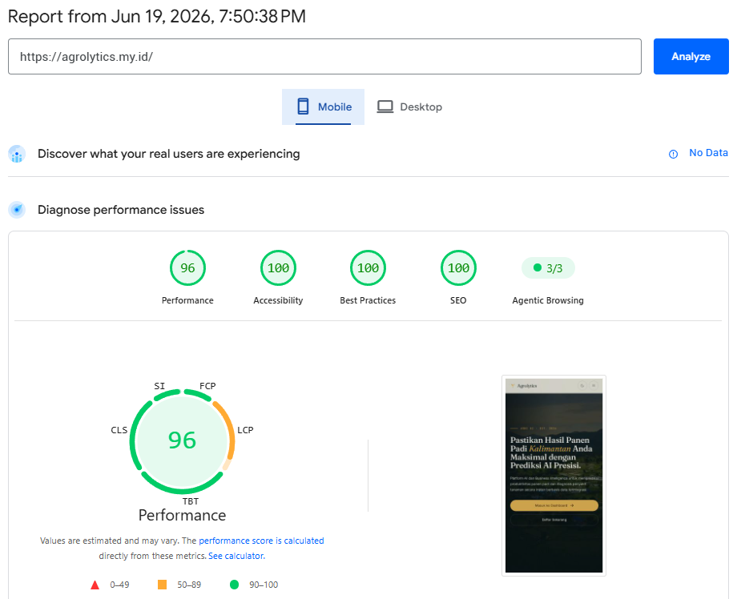
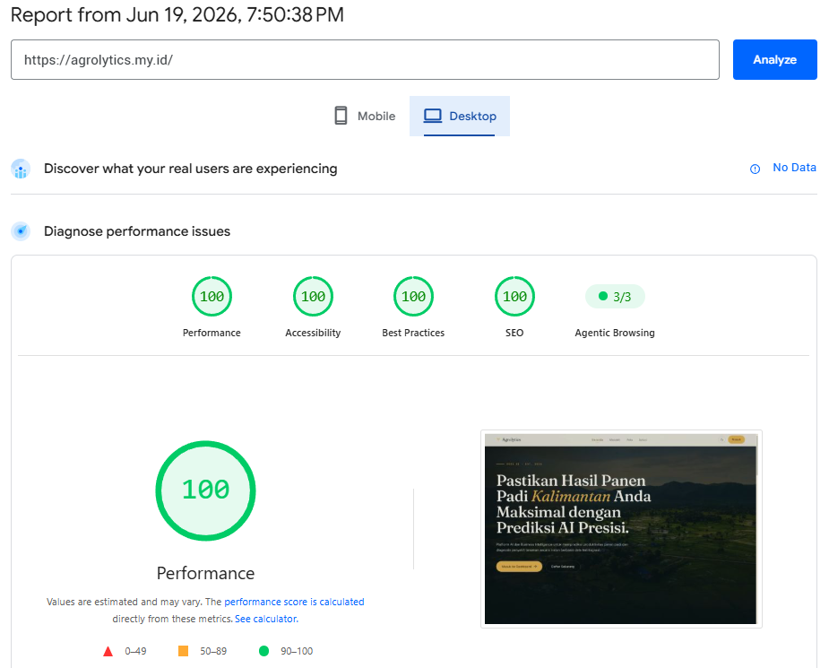
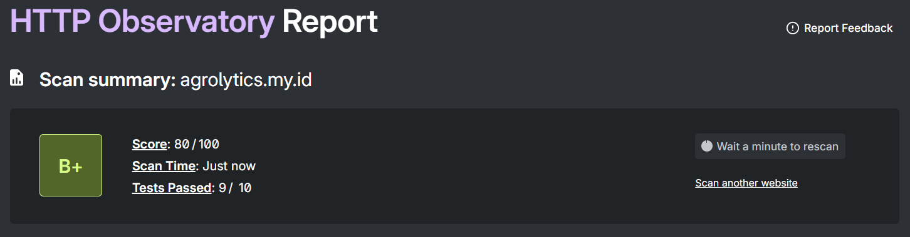

# 🌾 Agrolytics Web Frontend


[](https://github.com/Syntropys/web_frontend/blob/main/LICENSE)
[]()
[]()


[](https://github.com/Syntropys/web_frontend/issues)
[](https://github.com/Syntropys/web_frontend/pulls)

This repository contains the user-facing web dashboard for the **Agrolytics** Smart Agricultural Business Intelligence platform. It provides an interactive interface for monitoring, predicting, and analyzing rice paddy production across 56 regencies/cities in Kalimantan, Indonesia — integrating real BPS production data, NASA POWER climate data, ML-based yield predictions (XGBoost), K-Means risk clustering, and AI-powered paddy disease detection (10-class CNN ensemble).

> **Production**: [https://agrolytics.my.id](https://agrolytics.my.id)

## 📊 Google PageSpeed Insights (Lighthouse)

| Kategori | Mobile | Desktop |
| :------- | :----: | :-----: |
| ⚡ Performance | 96 | 100 |
| ♿ Accessibility | 100 | 100 |
| ✅ Best Practices | 100 | 100 |
| 🔍 SEO | 100 | 100 |

| Mobile | Desktop |
| :----: | :-----: |
|  |  |

## 🔒 Mozilla HTTP Observatory (Keamanan Header)

Skor **B+ (80/100)** — 9 dari 10 tes lolos. Dilengkapi CSP ketat, HSTS, X-Frame-Options, X-Content-Type-Options, dan header keamanan lainnya.



### 🔄 Repository & Deployment Flow

| Repository | URL | Role |
| :--------- | :-- | :--- |
| **Upstream** (Organization) | [Syntropys/web_frontend](https://github.com/Syntropys/web_frontend) | Main source of truth for team collaboration |
| **Fork** (Deploy) | [rohidrivaldi/agrolytics-fix](https://github.com/rohidrivaldi/agrolytics-fix) | Connected to Vercel for auto-deploy (CI/CD) |

```
Syntropys/web_frontend (upstream)
        │
        ▼  git push upstream main
rohidrivaldi/agrolytics-fix (origin)
        │
        ▼  auto-deploy on push
    Vercel → https://agrolytics.my.id
```

# 🛠 Tech Stack

             

| Layer | Technology | Purpose |
| :---- | :--------- | :------ |
| **Framework** | React 18 + TypeScript 5 | Component-based UI with type safety |
| **Build Tool** | Vite 6 | Fast HMR, optimized production builds |
| **Styling** | Tailwind CSS v4 + tw-animate-css | Utility-first CSS with animation presets |
| **Routing** | React Router v7 | File-based SPA routing |
| **Server State** | TanStack Query v5 | Async data fetching, caching, and synchronization |
| **Client State** | Zustand v5 | Lightweight global state (auth, theme) |
| **Charts** | Chart.js + react-chartjs-2 | Interactive line, bar, pie, and doughnut charts |
| **Maps** | Leaflet + react-leaflet | Choropleth map of 56 Kalimantan regencies with GeoJSON |
| **Animation** | Framer Motion v12 + Lenis | Page transitions, scroll-triggered reveals, smooth scrolling |
| **Auth** | Supabase Auth | Email/password + Google OAuth + email confirmation |
| **Database** | Supabase PostgreSQL | RLS-enforced queries via `supabase-js` |
| **Validation** | Zod v4 | Schema validation for env vars and data |
| **Icons** | Lucide React | Consistent icon system |
| **Export** | jsPDF + jspdf-autotable + xlsx + html2canvas | PDF, XLSX, CSV, JSON, GeoJSON export |
| **AI Chatbot** | Google Gemini API | Conversational analytics overlay |
| **Hosting** | Vercel | Auto-deploy from Git, CSP/security headers |

# 🗺️ Pages & Navigation

| Page | Route | Description |
| :--- | :---- | :---------- |
| 🏠 Landing | `/` | Hero section, interactive Kalimantan choropleth map, feature pillars |
| 🔐 Login | `/masuk` | Email/password + Google OAuth login |
| 📝 Register | `/daftar` | Registration with email confirmation |
| 🔑 Forgot Password | `/lupa-password` | Password reset request |
| 📊 Ringkasan | `/dashboard/ringkasan` | KPI widgets, top/bottom regions, trend chart |
| 🌡️ Data Iklim | `/dashboard/iklim` | NASA POWER climate data (rainfall, temperature, humidity) per region |
| 📈 Prediksi | `/dashboard/prediksi` | XGBoost yield predictions with actual vs predicted charts |
| 🗺️ Peta | `/dashboard/peta` | Full interactive choropleth map with region detail panel |
| ⚠️ Risiko | `/dashboard/risiko` | K-Means risk clustering (Tinggi/Sedang/Rendah) with distribution |
| 📉 Tren Historis | `/dashboard/tren` | Multi-region BPS production trend comparison (2018–2025) |
| 🎯 Prioritas | `/dashboard/prioritas` | Ranked region recommendations based on composite priority score |
| 🔬 Deteksi Penyakit | `/dashboard/penyakit` | Upload leaf photo → 10-class disease classification via Railway ML API |
| 👤 Admin: Pengguna | `/dashboard/admin/pengguna` | User management (admin-only) |
| 📥 Admin: Ingesti | `/dashboard/admin/ingesti` | Data ingestion from CSV (admin-only) |

# 🚀 Setup

1. **Clone the repository:**

   ```bash
   git clone https://github.com/Syntropys/web_frontend.git
   cd web_frontend
   ```

2. **Install dependencies:**

   ```bash
   pnpm install
   ```

3. **Configure environment variables:**

   ```bash
   cp .env.example .env
   ```

   Edit `.env` with your credentials (see [Environment Variables](#-environment-variables) below).

4. **Start development server:**

   ```bash
   pnpm run dev
   ```

   The app will be available at `http://localhost:5173`.

# 📜 Available Scripts

| Script | Command | Description |
| :----- | :------ | :---------- |
| Development | `pnpm run dev` | Start Vite dev server with HMR |
| Build | `pnpm run build` | Create optimized production build in `dist/` |
| Preview | `pnpm run preview` | Preview production build locally |

# 🔐 Environment Variables

Create a `.env` file in the root directory with the following variables:

| Variable | Required | Description |
| :------- | :------: | :---------- |
| `VITE_SUPABASE_URL` | ✅ | Supabase project URL |
| `VITE_SUPABASE_ANON_KEY` | ✅ | Supabase anonymous (public) API key |
| `VITE_DISEASE_API_URL` | ✅ | Railway ML service base URL for disease detection |
| `VITE_GEMINI_API_KEY` | ✅ | Google Gemini API key for AI chatbot |

# 📁 Project Structure

```
src/
├── app/
│   ├── components/        # Shared UI components
│   │   ├── hero.tsx       # Landing hero section
│   │   ├── peta.tsx       # Landing choropleth map (Leaflet)
│   │   ├── pillars.tsx    # Landing feature pillars
│   │   ├── nav.tsx        # Navigation bar
│   │   ├── footer.tsx     # Site footer
│   │   ├── dashboard-layout.tsx    # Dashboard shell with sidebar
│   │   ├── dashboard-widgets.tsx   # Reusable KPI cards & charts
│   │   ├── date-range-export-toolbar.tsx  # Filter + export toolbar
│   │   ├── ai-chatbot-overlay.tsx  # Gemini AI chatbot popup
│   │   └── ...
│   ├── pages/
│   │   ├── landing.tsx    # Landing page
│   │   ├── masuk.tsx      # Login
│   │   ├── daftar.tsx     # Register
│   │   ├── dashboard/
│   │   │   ├── ringkasan.tsx   # Summary dashboard
│   │   │   ├── iklim.tsx       # Climate data
│   │   │   ├── prediksi.tsx    # ML predictions
│   │   │   ├── peta.tsx        # Spatial map
│   │   │   ├── risiko.tsx      # Risk status
│   │   │   ├── tren.tsx        # Historical trends
│   │   │   ├── prioritas.tsx   # Priority recommendations
│   │   │   ├── penyakit.tsx    # Disease detection
│   │   │   └── admin/          # Admin-only pages
│   │   └── ...
│   └── routes.ts          # Route definitions
├── hooks/                 # Custom React hooks (useRegions, usePredictions, etc.)
├── services/              # Supabase data access layer
├── stores/                # Zustand stores (auth, theme)
├── schemas.ts             # Zod validation schemas
├── lib/
│   ├── supabase.ts        # Supabase client initialization
│   └── queryClient.ts     # TanStack Query client config
├── types/                 # TypeScript type definitions
└── main.tsx               # App entry point
```

# 🤝 Contributing

Contributions are welcome! If you have suggestions for improvements or want to report an issue, feel free to open a pull request or create an issue. Thank you for helping to make this project better!

# ⚖️ License

This project is licensed under the GNU AGPLv3. See the [LICENSE](LICENSE) file for more details.
